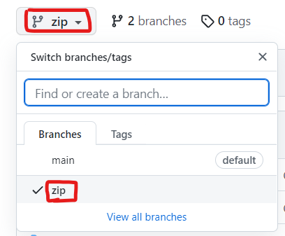
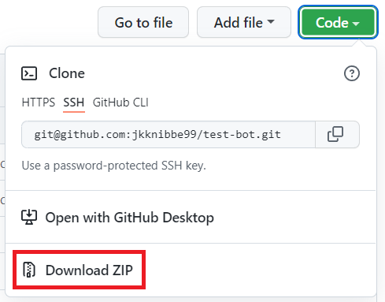
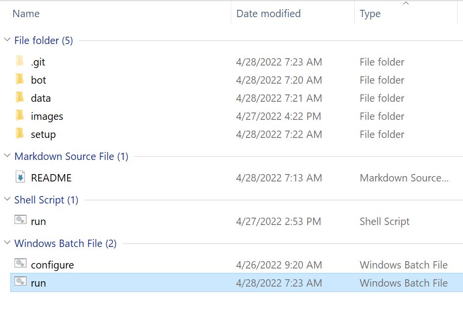
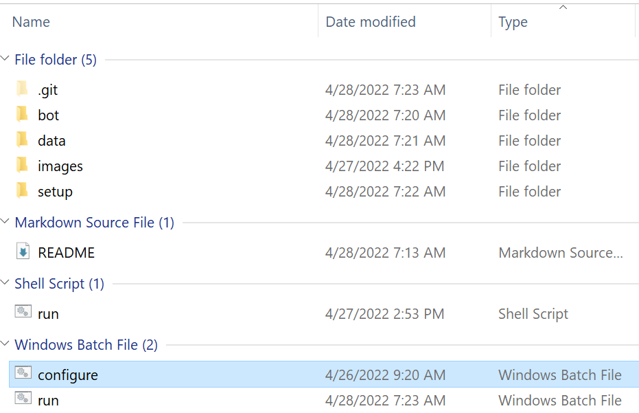
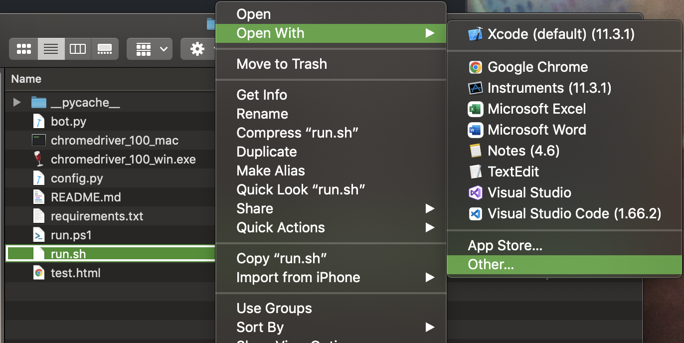
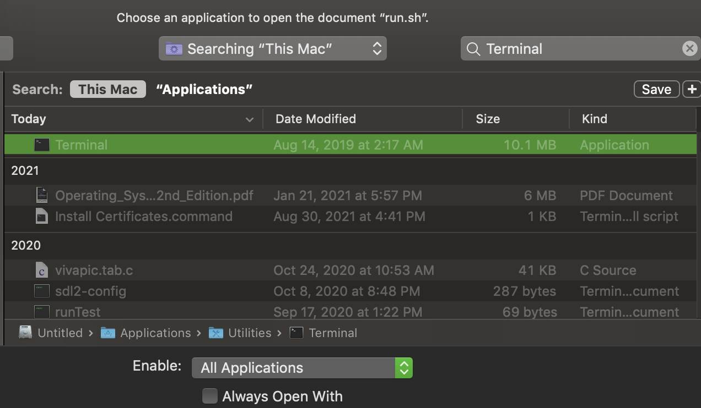

# Instructions
## Windows

    
Steps

    <ol>
        <li>
            Switch to the zip branch. 
            
        </li>
        <li>
            Download the zip file 
            
        </li>
        <li>Browse to where you downloaded the zip file</li>
        <li>Extract the zip</li>
        <li>Open the extracted folder</li>
        <li>
            Locate the run.bat file (It will be a Windows Batch file type) 
            Double click the file 
            
        </li>
        <li>
            A Command Prompt instance should now appear and the program should load. This may take some time.
        </li>
        <li>
            If you do not have Python installed, you should see a dialog asking you to install it.
        </li>
        <li>
            Once the program is loaded, you may be asked to fill out some user information like username, password, etc.
        </li>
        <li>
            Once user data is filled out correctly, the Chrome instance will be created and the bot will run.
        </li>
        <li>
            If at any point you would like to modify your user data, go into the program folder and locate the configure.bat file. 
            Double click it to confirm/reset your user data. 
            
        </li>
    </ol>

 

## Mac
Not yet supported.
<!-- 

    
Steps

    <h3 style="color: red;">WARNING: These steps are untested and most likely deprecated!</h4>
    <ol>
        <li>
            Download the zip file 
            
        </li>
        <li>Browse to where you downloaded the zip file</li>
        <li>Double click the zip file</li>
        <li>Open the new folder that was extracted</li>
        <li>Locate the run.sh file (It is a Shell Script file type)</li>
        <li>
            Right-click on the run.sh file > Select Open With > Select Other.
             
            
        </li>
        <li>
            In the 'Choose Application' dialog box, set Enable to 'All Applications' 
            In the search bar, type 'Terminal' 
            The Terminal application should appear at or near the top of the list. Double-click it. 
            
        </li>
        <li>
            A Terminal instance should now appear and the program should load. This may take some time. 
            Once the program is loaded, the Chrome instance will be created and the bot will run.
        </li>
    </ol>

 -->
